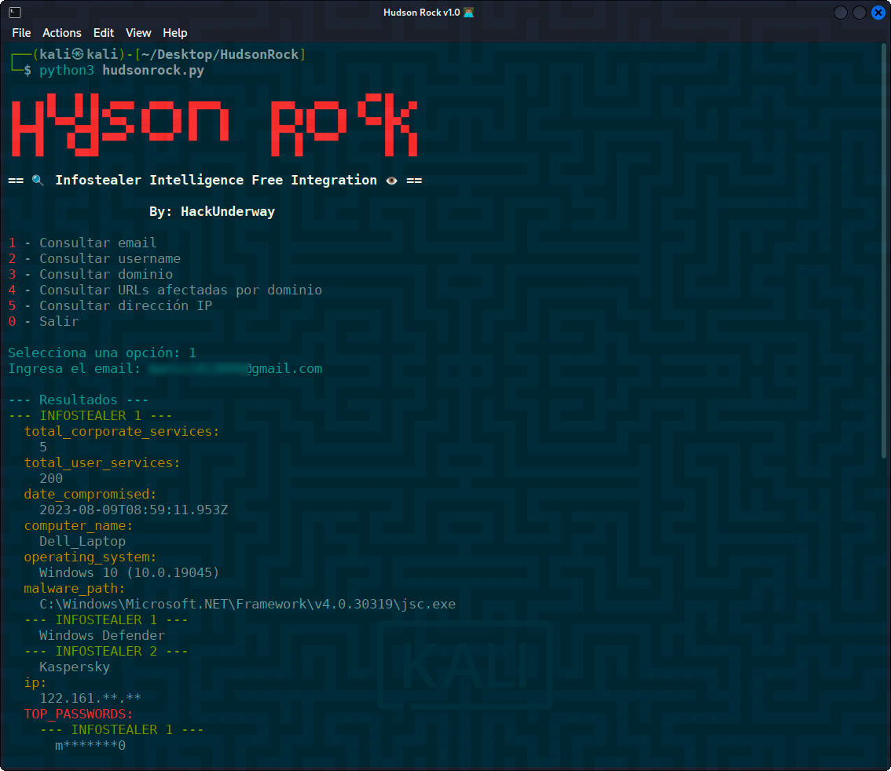

<h1 align="center">HudsonRock 👁</h1>

<p align="center">
  Herramienta OSINT para consultar información sobre equipos comprometidos mediante las APIs gratuitas de Hudson Rock.
</p>

<p align="center">
  
</p>

<p align="center">
  
  
</p>

---

## 🚀 Características

- Consulta por email, username, dominio, URLs afectadas o dirección IP
- Muestra información detallada de equipos infectados:
  - Fecha de compromiso
  - Nombre del equipo y sistema operativo
  - Contraseñas y logins encontrados
  - Malware detectado
- Interfaz intuitiva con menú interactivo
- Resultados formateados para mejor legibilidad

## 📌 Requisitos

- Python 3.11+

- Librerías: `requests`, `colorama`

## ⚠️ Advertencia

#### Esta herramienta solo debe usarse para:

- ✅ Verificar tus propios emails

- ✅ Con fines educativos

- ✅ Auditorías de seguridad autorizadas

- ✅ Investigaciones OSINT

###### No se recomienda su uso para violar privacidad o realizar actividades ilegales.

---
## ⚙️ Instalación

Clona el repositorio:

```bash
git clone https://github.com/HackUnderway/HudsonRock.git
```
```bash
cd HudsonRock
```
```bash
pip install -r requirements.txt
```

## 🚀 Uso
##### Pones este comando en tu terminal

python3 hudsonrock.py

##### Elige la opción que quieres consultar o salir del script

1 - Consultar email

2 - Consultar username

3 - Consultar dominio

4 - Consultar URLs afectadas por dominio

5 - Consultar dirección IP

0 - Salir

> **El proyecto está abierto a colaboradores.**

# DISTRIBUCIONES SOPORTADAS
|Distribución | Versión verificada | 	¿Soportado? | 	Estado |
|--------------|--------------------|------|-------|
|Kali Linux| 2025.1| si| funcionando   |
|Parrot Security OS| 6.2| si | funcionando   |
|Windows| 11 | si | funcionando   |
|BackBox| 9 | si | funcionando   |
|Arch Linux| 2024.12.01 | si | funcionando   |

# SOPORTE
Preguntas, errores o sugerencias: info@hackunderway.com

# LICENSE
- [x] HudsonRock tiene licencia.
- [x] Consulta el archivo [LICENSE](https://github.com/HackUnderway/HudsonRock#MIT-1-ov-file) para más información.

# CYBERSECURITY RESEARCHER

* [Victor Bancayan](https://www.offsec.com/bug-bounty-program/) - (**CEO at [Hack Underway](https://hackunderway.com/)**) 

## 🔗 ENLACES
[](https://www.patreon.com/c/HackUnderway)
```
Fanpage: https://www.facebook.com/HackUnderway
X: https://x.com/JeyZetaOficial
Web site: https://hackunderway.com
Youtube: https://www.youtube.com/@JeyZetaOficial
```

## ☕️ Support me

If you like this project, consider buying me a coffee:

[](https://www.buymeacoffee.com/hackunderway)

## 🌞 Suscripciones

###### Suscríbete: [Jey Zeta](https://www.facebook.com/JeyZetaOficial/subscribe/)

[](https://www.kali.org/)

from  made in  with  by: <font color="red">Victor Bancayan</font>

© 2025
